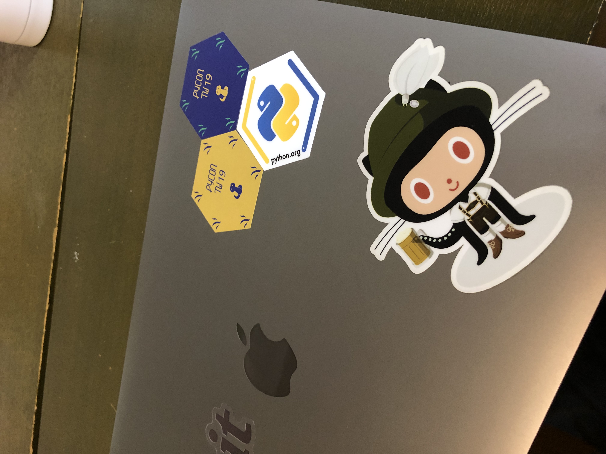
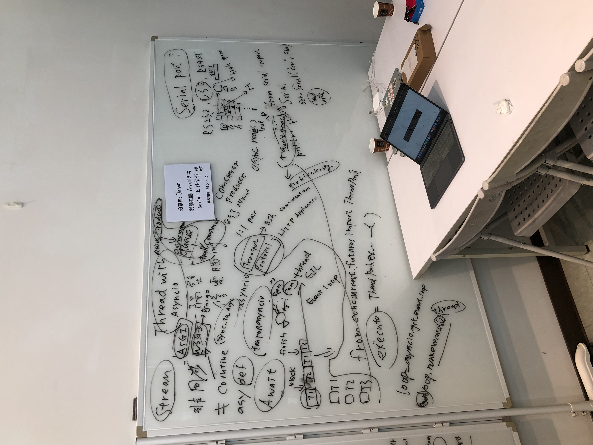
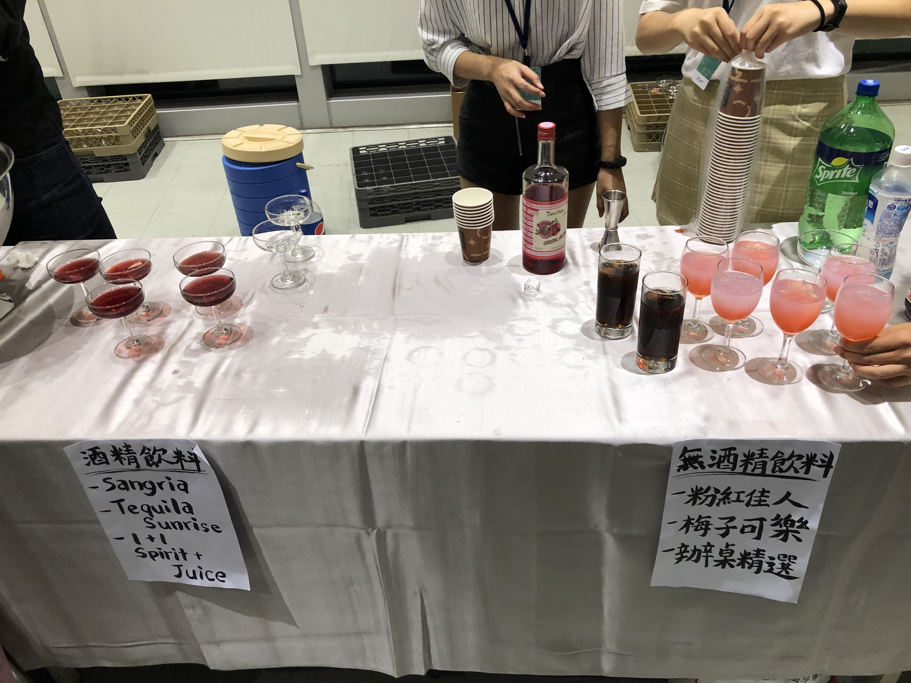

每年在 PyCon Taiwan 的幾天總是讓我在探索不同領域技術上有源源不絕的動力，我想這是因為透過講者分享、會眾彼此之間的交流，總是挑起我對各種應用的好奇心，也期許自己可以像這些大大們一樣回饋給剛起步的人。

今年除了和去年參加有一些不同：

1. 謝謝主席大大 Taihsiang 去年在 Python 官方文件翻譯的 meetup 上邀請了我，今年參加了志工，去年僅僅只是會眾
2. 今年的 Open Space 與去年不同，期間沒有議程並且拉到四樓兩側走廊進行，相較去年也多了比較多人舉辦不同的主題

    

3. 今年的 PyNight 真的很盡興，有著音樂會、披薩、炸雞、飲料、✨調酒✨

    

4. 心態上我從過去只是想去聽議程學習知識，變成希望和來自各國各領域的人多多交流，這個轉變讓我獲得了更多，真的非常開心

但是今天這篇心得主要並非要談我在 PyCon Taiwan 所得知新的技術或什麼有趣的應用，反而比較多是我對社群、開源貢獻的重新反思了解，並且也深深感謝來自首爾 的 younggun 前輩，願意與英文障礙的我聊那麼久，並分享了他在社群的多年經驗 Orz：

作為一個新手對於開源貢獻跟社群參與感覺有點格格不入，我可能看到什麼自己有用但也沒有非常熟悉的 library 想要了解他的實作，並且嘗試解一些 issue，然而看到複雜的程式卻不知道從何下手，最後不了了之；對於社群有時會想要給 talk，但老實說，心中根本不知道有什麼可以分享的內容。我向 younggun 詢問了這兩個問題，聊了快一個小時（真的心懷感激 🙌）解惑之後深深了解到原來自己的心態也許有一些不太正確。

我重新認識了社群跟開源，給 talk 與發 pr 其實背後的動機是ㄧ樣的 — **分享**以及**開放的心態** (open mind)，沒有為了給 talk 而給，也沒有為了想要改某個 library 而去發的 pr，想要成名的人在社群是不能夠長久的。在台上的講者，想要分享過去所做有趣的應用、有什麼新的發現，而在台下的人抱持著開放的心態聆聽分享，甚至不限於議程，在研討會上的任何地方，都抱持著開放的心態與人交流，我想這是辦研討會的目的吧。

我還有很多要學習，過去有時候抱持著比較的心態認識人，真的很糟糕😰，意識到應該持有觀念後， 在之後的所有活動真心覺得抱著這樣的心態與人交流真的很開心，跟許多的人不論國內國外的與會者交了朋友，了解了好多自己未接觸過的事物，剩下還有比較大的問題就是語言了（好多不同口音英文都還是聽不太懂），而在會議之後我想到了以我目前的能力，也有專案是我足夠熟習也適合我去貢獻，並且也想到了好多的應用很有趣很想嘗試實作，也許也會是一個非常有趣的主題可以分享給其他人，我過去沒有意識到的原因可能在於我並不足夠的 open mind，認為自己並不夠資格分享，然而事實上是人人都是可以分享的。

我很感謝 PyCon Taiwan 可以讓我有這樣個機會可以學習，在做志工時可以認識到 james, GTB, shy, david，實在是很難得的機會，我想我有許多對 CS 的熱情是來自於從社群，而過去的我還不知道什麼樣才是較好的參與方式，謝謝 Taihsiang 和 Adrian 可以帶我到社群，還有 PyCon Taiwan 的所有工作人員，讓這個研討會可以成功。
